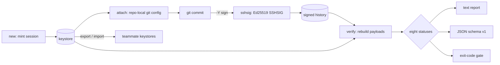

# botsign

[English](README.md) | [中文](README.zh.md) | [日本語](README.ja.md)

[](LICENSE) [](go.mod) [](CHANGELOG.md)  [](CONTRIBUTING.md)

**botsign：AI エージェントのセッションごとに独立した暗号学的 git アイデンティティを与える、オープンソース・依存ゼロの CLI——セッション署名鍵を発行し、コミットの作者情報を設定し、誰が何をしたかを検証する。**


```bash
git clone https://github.com/JaydenCJ/botsign && cd botsign
go build -o botsign ./cmd/botsign    # single static binary, stdlib only
```

> プレリリース：v0.1.0 はまだパッケージレジストリに公開されていません。上記の手順でソースからビルドしてください（Go ≥1.22、git ≥2.34 で動作）。

## なぜ botsign？

AI エージェントは既に本番コードをコミットしており、「このコミットはどのエージェントセッションが書いたのか？」は良い答えのないコンプライアンス上の問いになりました。trailer の慣習（`Co-Authored-By:`、`AI-Assisted:`）はただのテキスト——誰でも書け、誰でも消せ、誰も検証しません。個人の GPG/SSH 署名鍵が証明するのは「開発者」であって「セッション」ではありません：どのエージェント実行も同じ人間として署名するため、鍵の漏洩や暴走した実行は通常の作業と区別がつきません。Sigstore の gitsign は暗号学的には正しいものの、OIDC の往復と CA 基盤を要求します——ラップトップ、隔離された CI マシン、大量の使い捨てエージェントコンテナには、まさにそれがありません。botsign は地味で検証可能な道を選びます：**エージェントセッションごと**に 1 本の Ed25519 鍵をコマンド一発でローカル発行し、botsign 自身を署名バックエンドとして git ネイティブの SSH 署名に接続——そして `botsign verify` が任意のコミット範囲を走査し、署名対象ペイロードをバイト単位で再構築して、*どのセッション*が何をしたかを示し、なりすまし・鍵の使い回し・失効セッション・期限切れの権限を引用可能な証拠付きで検出します。

| | botsign | commit trailers | gitsign (Sigstore) | 個人 SSH/GPG 鍵 |
|---|---|---|---|---|
| テキスト宣言ではなく暗号学的証明 | ✅ | ❌ ただのテキスト | ✅ | ✅ |
| 人ではなく*セッション*を識別 | ✅ | ❌ 検証なし | ❌ 開発者単位の OIDC | ❌ 開発者単位の鍵 |
| エージェント身分のなりすましを検出 | ✅ | ❌ | ❌ | ❌ |
| 全体ローテーションなしで単一セッションを失効 | ✅ | ❌ | ✅ 短命証明書 | ❌ 全面ローテーション |
| 完全オフラインで動作（CA・OIDC・keyserver 不要） | ✅ | ✅ | ❌ Fulcio/Rekor | ✅ |
| 鍵発行 + リポジトリ設定がコマンド一発 | ✅ | n/a | ❌ | ❌ 手動設定 |
| ランタイム依存 | 0 | n/a | 40+ Go モジュール + サービス | OpenSSH/GnuPG が必要 |

<sub>2026-07-12 時点の確認：botsign は Go 標準ライブラリのみを import し、外部呼び出しはローカルの `git` だけ。sigstore/gitsign の go.mod には 40+ の直接/間接モジュール依存があり、既定の検証は Fulcio/Rekor エンドポイントへアクセスします。</sub>

## 機能

- **鍵は開発者単位ではなくセッション単位** — `botsign new --agent claude-code` が新しい Ed25519 鍵ペアとセッション身分（`claude-code+27a11a7e@botsign.invalid`）を発行。セッション ID は鍵のフィンガープリントから導出されるため、身分と鍵が乖離することはありません。
- **ゼロから署名までコマンド一発** — `--repo` でその場でリポジトリを配線：リポジトリローカルの `user.*`、`gpg.format=ssh`、`user.signingKey`、`commit.gpgsign`——グローバル設定には一切触れず、`detach` で管理下の設定を全て除去できます。
- **自分自身が署名バックエンド** — git が `gpg.ssh.program` 経由で呼ぶ `ssh-keygen -Y` インターフェース（`sign`、`verify`、`find-principals`、`check-novalidate`）を botsign が実装。OpenSSH ツールチェーンなしで `git commit`、`git verify-commit`、`git log --show-signature` が動作し、出力は標準 SSHSIG なので素の `ssh-keygen` でも検証できます。
- **バイト単位・証拠第一の監査** — `botsign verify` が生オブジェクトから各コミットの署名対象ペイロードを再構築し、全コミットを 8 状態の閉じた集合に分類。失敗時は正確な理由を出力します（`signed by agent-b-… but committed as …`）。
- **なりすましは一級の失敗** — 鍵を持たずに `user.email` へセッション身分を設定すると `unsigned`、セッション鍵を他人の身分で使うと `mismatch`。どちらも監査失敗、終了コード 1 です。
- **監査可能なライフサイクル** — `--ttl` でセッションに期限を与えコミットのタイムスタンプと照合。`revoke` は秘密鍵を破棄し、そのセッションの過去コミットも遡って失敗扱いに。`sessions`/`status` でどこで何が生きているかを確認できます。
- **チームへ持ち運べる依存ゼロの信頼** — `export`/`import` が 1 行の公開「セッションカード」（ID は鍵と暗号学的に結合）をマシン間で運びます。全てオフライン、テレメトリなし、純粋な標準ライブラリのみ。

## クイックスタート

```bash
# mint a session for the agent about to work, and wire the repo to it
botsign new --agent claude-code --repo /tmp/botsign-demo
```

実際にキャプチャした出力：

```text
session   claude-code-27a11a7e
agent     claude-code
key       SHA256:J6EafltdlgjWWymzgGxLiiBWvictqx1bJuFLFRKhPZE
email     claude-code+27a11a7e@botsign.invalid
created   2026-07-12T23:33:40Z
expires   never
attached  /tmp/botsign-demo (commit signing on)
```

以後エージェントは普通に `git commit` するだけ——全てのコミットに署名が付きます。いつでも監査できます（`botsign verify`、実出力。最新のコミットは鍵を持たずにセッション身分を名乗っています）：

```text
botsign verify — botsign-demo @ be16cf5 (main)
range: HEAD · 4 commits

  be16cf5  unsigned       claude-code-27a11a7e     Tune the limiter defaults
           └─ committer claims a botsign identity but the commit is unsigned
  1a62bd8  unmanaged      —                        Document restarts
  a7b3f58  verified       claude-code-27a11a7e     Cover the limiter window
  69564b3  verified       claude-code-27a11a7e     Add rate limiter

summary: 2 verified · 1 unmanaged · 1 unsigned
verify: FAIL (1 failing commit)
```

素の git も同じ結論に達します。SSH 署名プログラムが botsign 自身だからです（実出力）：

```text
$ git verify-commit HEAD~2
Good "git" signature for claude-code+27a11a7e@botsign.invalid with ED25519 key SHA256:J6EafltdlgjWWymzgGxLiiBWvictqx1bJuFLFRKhPZE
```

フルシナリオを自分で試すには：`bash examples/make-demo-repo.sh /tmp/botsign-demo`。

## 検証ステータス

分類は (commit, keystore) 上の純関数です——詳細は [docs/signature-format.md](docs/signature-format.md)。

| ステータス | 意味 | 失敗扱い |
|---|---|---|
| `verified` | 既知かつ有効なセッションの正当な署名。身分も一致 | いいえ |
| `unmanaged` | 人間のコミット：セッション身分もセッション署名もなし | `--require-signed` 時のみ |
| `unsigned` | セッション身分を名乗りつつ無署名——なりすまし | はい |
| `bad-signature` | 署名はあるが暗号学的に無効 | はい |
| `unknown-key` | 身分は名乗るが署名鍵が keystore にない | はい |
| `mismatch` | セッション X の有効署名が身分 Y の下に——鍵の使い回し | はい |
| `revoked` | 有効な署名だがセッションは失効済み | はい |
| `expired` | コミットのタイムスタンプがセッションの `--ttl` 期限より後 | はい |

## CLI リファレンス

`botsign <command> [flags]` — 終了コード：0 正常、1 verify/status 失敗、2 使い方エラー、3 実行時エラー。全コマンドが `--keystore`（または `BOTSIGN_KEYSTORE`。既定はユーザー設定ディレクトリ）を受け付けます。

| コマンド | 効果 |
|---|---|
| `new --agent NAME` | セッション鍵 + 身分を発行（`--repo` で同時配線、`--ttl 8h` で期限、`--json`） |
| `attach SESSION [path]` | 既存セッションをリポジトリへ配線 |
| `detach` / `status [path]` | 管理下の設定を除去 / 配線状態を監査 |
| `verify [flags] [path]` | 範囲を監査：`--range main..HEAD`、`--format json`、`--require-signed` |
| `sessions` / `show SESSION` | keystore を一覧 / 単一セッションを表示（`--json`） |
| `export [SESSION…]` | 1 行の公開セッションカードを出力（allowed_signers 形式） |
| `import FILE\|-` | エクスポート済みカードを取り込み。ID は再導出され鍵と照合 |
| `revoke SESSION` | 秘密鍵を破棄し、以後そのセッションの履歴を失敗扱いに |

## 検証について

このリポジトリは CI を同梱しません。上記の全ての主張はローカル実行で検証されます：

```bash
go test ./...            # 91 deterministic tests, offline, < 5 s
bash scripts/smoke.sh    # end-to-end: real git signing + audit, prints SMOKE OK
```

## アーキテクチャ



## ロードマップ

- [x] v0.1.0 — セッション鍵の発行、コマンド一発のリポジトリ配線、ssh-keygen `-Y` 署名バックエンド、バイト単位の 8 状態監査、export/import、失効と期限、91 テスト + smoke スクリプト
- [ ] タグ署名と `verify --tags`
- [ ] `botsign log` — セッション別の作業サマリ（コミット数、変更ファイル、期間）
- [ ] ハードウェア保護されたセッション鍵（ssh-agent、TPM、Secure Enclave）
- [ ] インポート時に allowed_signers の `valid-after`/`valid-before` オプションを強制
- [ ] ホスティングサービス連携ガイド（セッション公開鍵を登録して Web UI に "Verified" を表示）

全リストは [open issues](https://github.com/JaydenCJ/botsign/issues) を参照。

## コントリビュート

issue・ディスカッション・PR を歓迎します——ローカルの作業フロー（format、vet、テスト、`SMOKE OK`）は [CONTRIBUTING.md](CONTRIBUTING.md) を参照。入門向けタスクは [good first issue](https://github.com/JaydenCJ/botsign/issues?q=is%3Aissue+is%3Aopen+label%3A%22good+first+issue%22)、設計の議論は [Discussions](https://github.com/JaydenCJ/botsign/discussions) で。

## ライセンス

[MIT](LICENSE)
