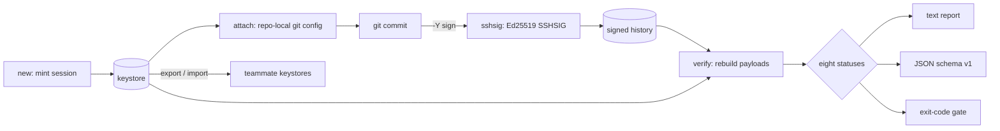

# botsign

[English](README.md) | [中文](README.zh.md) | [日本語](README.ja.md)

[](LICENSE) [](go.mod) [](CHANGELOG.md)  [](CONTRIBUTING.md)

**botsign：an open-source, zero-dependency CLI that gives every AI-agent session its own cryptographic git identity — mints session signing keys, sets authorship, and verifies who did what.**


```bash
git clone https://github.com/JaydenCJ/botsign && cd botsign
go build -o botsign ./cmd/botsign    # single static binary, stdlib only
```

> Pre-release: v0.1.0 is not tagged on a package registry yet; build from source as above (any Go ≥1.22, git ≥2.34).

## Why botsign?

AI agents now land code in production, and "which agent session wrote this commit?" has become a compliance question with no good answer. Trailer conventions (`Co-Authored-By:`, `AI-Assisted:`) are plain text — anything can write them, anything can strip them, and nothing checks them. Personal GPG/SSH signing keys prove a *developer*, not a *session*: every agent run signs as the same human, so a leaked key or a rogue run is indistinguishable from normal work. Sigstore's gitsign gets the cryptography right but needs OIDC round-trips and CA infrastructure, which is exactly what a laptop, an air-gapped CI box, or a fleet of ephemeral agent containers doesn't have. botsign takes the boring, verifiable path: one Ed25519 key **per agent session**, minted locally in one command, wired into git's native SSH signing with botsign itself as the signing backend — then `botsign verify` walks any commit range, rebuilds each signed payload byte-exactly, and tells you *which session* did what, flagging impersonation, key reuse, revoked sessions, and expired authority with quotable evidence.

| | botsign | commit trailers | gitsign (Sigstore) | personal SSH/GPG key |
|---|---|---|---|---|
| Cryptographic proof, not a text claim | ✅ | ❌ plain text | ✅ | ✅ |
| Identifies the *session*, not just the human | ✅ | ❌ unchecked | ❌ per-developer OIDC | ❌ per-developer key |
| Catches impersonation of an agent identity | ✅ | ❌ | ❌ | ❌ |
| Revoke one session without rotating everything | ✅ | ❌ | ✅ short-lived certs | ❌ full rotation |
| Works fully offline (no CA, OIDC, keyserver) | ✅ | ✅ | ❌ Fulcio/Rekor | ✅ |
| One command to mint + wire a repo | ✅ | n/a | ❌ | ❌ manual config |
| Runtime dependencies | 0 | n/a | 40+ Go modules + services | OpenSSH/GnuPG install |

<sub>Checked 2026-07-12: botsign imports the Go standard library only and shells out solely to the local `git`; sigstore/gitsign's go.mod lists 40+ direct/indirect module requirements and default verification calls Fulcio/Rekor endpoints.</sub>

## Features

- **A key per session, not per developer** — `botsign new --agent claude-code` mints a fresh Ed25519 keypair and a session identity (`claude-code+27a11a7e@botsign.invalid`) whose ID is derived from the key's own fingerprint, so identity and key cannot drift apart.
- **One command from zero to signing** — `--repo` wires the repository on the spot: repo-local `user.*`, `gpg.format=ssh`, `user.signingKey`, `commit.gpgsign` — nothing global is ever touched, and `detach` removes every managed key.
- **Its own signing backend** — botsign implements the `ssh-keygen -Y` interface (`sign`, `verify`, `find-principals`, `check-novalidate`) that git calls via `gpg.ssh.program`, so `git commit`, `git verify-commit`, and `git log --show-signature` all work with no OpenSSH toolchain installed — while emitting standard SSHSIG that a stock `ssh-keygen` verifies too.
- **Byte-exact, evidence-first audits** — `botsign verify` rebuilds each commit's signed payload from the raw object and classifies every commit into a closed set of eight statuses; failures print the exact reason (`signed by agent-b-… but committed as …`).
- **Impersonation is a first-class failure** — setting `user.email` to a session identity without holding its key yields `unsigned`; a session key used under someone else's identity yields `mismatch`. Both fail the audit, exit code 1.
- **Auditable lifecycle** — `--ttl` gives sessions an expiry checked against commit timestamps; `revoke` shreds the private key and retroactively fails the session's commits; `sessions`/`status` show what is live where.
- **Team-portable, zero-dependency trust** — `export`/`import` move one-line public "session cards" (IDs cryptographically bound to keys) between machines; everything is offline, telemetry-free, standard library only.

## Quickstart

```bash
# mint a session for the agent about to work, and wire the repo to it
botsign new --agent claude-code --repo /tmp/botsign-demo
```

Real captured output:

```text
session   claude-code-27a11a7e
agent     claude-code
key       SHA256:J6EafltdlgjWWymzgGxLiiBWvictqx1bJuFLFRKhPZE
email     claude-code+27a11a7e@botsign.invalid
created   2026-07-12T23:33:40Z
expires   never
attached  /tmp/botsign-demo (commit signing on)
```

The agent then works with plain `git commit` — every commit comes out signed. Audit any time (`botsign verify`, real output; the newest commit claims the session's identity without holding its key):

```text
botsign verify — botsign-demo @ be16cf5 (main)
range: HEAD · 4 commits

  be16cf5  unsigned       claude-code-27a11a7e     Tune the limiter defaults
           └─ committer claims a botsign identity but the commit is unsigned
  1a62bd8  unmanaged      —                        Document restarts
  a7b3f58  verified       claude-code-27a11a7e     Cover the limiter window
  69564b3  verified       claude-code-27a11a7e     Add rate limiter

summary: 2 verified · 1 unmanaged · 1 unsigned
verify: FAIL (1 failing commit)
```

Stock git agrees, because botsign is its SSH signing program (real output):

```text
$ git verify-commit HEAD~2
Good "git" signature for claude-code+27a11a7e@botsign.invalid with ED25519 key SHA256:J6EafltdlgjWWymzgGxLiiBWvictqx1bJuFLFRKhPZE
```

Try the full scenario yourself: `bash examples/make-demo-repo.sh /tmp/botsign-demo`.

## Verification statuses

Classification is a pure function over (commit, keystore) — details in [docs/signature-format.md](docs/signature-format.md).

| Status | Meaning | Fails |
|---|---|---|
| `verified` | valid signature by a known, live session; identity matches | no |
| `unmanaged` | human commit: no session identity, no session signature | only with `--require-signed` |
| `unsigned` | session identity claimed, no signature — impersonation | yes |
| `bad-signature` | signature present but cryptographically invalid | yes |
| `unknown-key` | claimed identity, but the signing key is not in the keystore | yes |
| `mismatch` | valid signature by session X under identity Y — key reuse | yes |
| `revoked` | valid signature by a session that has been revoked | yes |
| `expired` | commit timestamped after the session's `--ttl` deadline | yes |

## CLI reference

`botsign <command> [flags]` — exit codes: 0 ok, 1 verify/status failure, 2 usage error, 3 runtime error. Every command accepts `--keystore` (or `BOTSIGN_KEYSTORE`; default: the user config dir).

| Command | Effect |
|---|---|
| `new --agent NAME` | mint a session key + identity (`--repo` also attaches, `--ttl 8h` sets expiry, `--json`) |
| `attach SESSION [path]` | wire an existing session into a repository |
| `detach` / `status [path]` | remove the managed config / audit the wiring |
| `verify [flags] [path]` | audit a range: `--range main..HEAD`, `--format json`, `--require-signed` |
| `sessions` / `show SESSION` | list the keystore / print one session (`--json`) |
| `export [SESSION…]` | print one-line public session cards (allowed_signers format) |
| `import FILE\|-` | ingest exported cards; IDs are re-derived and checked against keys |
| `revoke SESSION` | shred the private key and fail the session's history from now on |

## Verification

This repository ships no CI; every claim above is verified by local runs:

```bash
go test ./...            # 91 deterministic tests, offline, < 5 s
bash scripts/smoke.sh    # end-to-end: real git signing + audit, prints SMOKE OK
```

## Architecture



## Roadmap

- [x] v0.1.0 — session key minting, one-command repo wiring, ssh-keygen `-Y` signing backend, byte-exact eight-status audit, export/import, revocation & expiry, 91 tests + smoke script
- [ ] Tag signing and `verify --tags`
- [ ] `botsign log` — per-session work summaries (commits, files touched, time span)
- [ ] Hardware-backed session keys (ssh-agent, TPM, Secure Enclave)
- [ ] Enforce `valid-after`/`valid-before` allowed_signers options on import
- [ ] Forge integration notes (upload session public keys so the web UI shows "Verified")

See the [open issues](https://github.com/JaydenCJ/botsign/issues) for the full list.

## Contributing

Issues, discussions and pull requests are welcome — see [CONTRIBUTING.md](CONTRIBUTING.md) for the local workflow (format, vet, tests, `SMOKE OK`). Good entry points are labelled [good first issue](https://github.com/JaydenCJ/botsign/issues?q=is%3Aissue+is%3Aopen+label%3A%22good+first+issue%22), and design questions live in [Discussions](https://github.com/JaydenCJ/botsign/discussions).

## License

[MIT](LICENSE)
