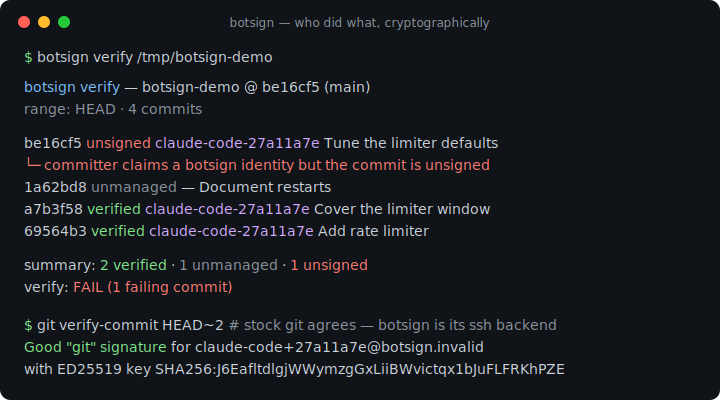
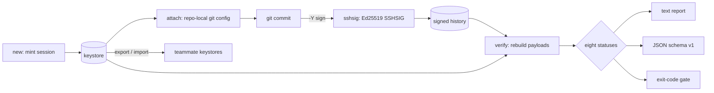

# botsign

[English](README.md) | [中文](README.zh.md) | [日本語](README.ja.md)

[](LICENSE) [](go.mod) [](CHANGELOG.md)  [](CONTRIBUTING.md)

**botsign：开源、零依赖的 CLI，为每个 AI 代理会话赋予独立的 git 密码学身份——铸造会话签名密钥、设置提交作者、验证到底是谁做了什么。**



```bash
git clone https://github.com/JaydenCJ/botsign && cd botsign
go build -o botsign ./cmd/botsign    # single static binary, stdlib only
```

> 预发布说明：v0.1.0 尚未发布到任何包仓库；请按上面的方式从源码构建（Go ≥1.22、git ≥2.34 即可）。

## 为什么选 botsign？

AI 代理已经在往生产环境提交代码，"这个 commit 是哪个代理会话写的？"成了一个没有好答案的合规问题。trailer 约定（`Co-Authored-By:`、`AI-Assisted:`）只是纯文本——谁都能写、谁都能删，也没有任何东西去校验。个人 GPG/SSH 签名密钥证明的是"某个开发者"而不是"某次会话"：每次代理运行都以同一个人的身份签名，密钥泄露或某次失控的运行与正常工作毫无区别。Sigstore 的 gitsign 密码学上没问题，但需要 OIDC 往返和 CA 基础设施——而笔记本、离线的 CI 机器、成批的临时代理容器恰恰没有这些。botsign 走的是朴素而可验证的路线：**每个代理会话**一把 Ed25519 密钥，一条命令本地铸造，接入 git 原生 SSH 签名、由 botsign 自己充当签名后端——然后 `botsign verify` 遍历任意提交范围，逐字节重建每个被签名的载荷，告诉你*哪个会话*做了什么，并以可引用的证据标记冒名、密钥复用、已吊销会话和过期授权。

| | botsign | commit trailers | gitsign (Sigstore) | 个人 SSH/GPG 密钥 |
|---|---|---|---|---|
| 密码学证明而非文本声明 | ✅ | ❌ 纯文本 | ✅ | ✅ |
| 识别到*会话*而不只是人 | ✅ | ❌ 无校验 | ❌ 按开发者 OIDC | ❌ 按开发者密钥 |
| 能抓住冒用代理身份 | ✅ | ❌ | ❌ | ❌ |
| 吊销单个会话而无需全量轮换 | ✅ | ❌ | ✅ 短期证书 | ❌ 整体轮换 |
| 完全离线可用（无 CA、OIDC、keyserver） | ✅ | ✅ | ❌ Fulcio/Rekor | ✅ |
| 一条命令完成铸钥 + 接线 | ✅ | n/a | ❌ | ❌ 手工配置 |
| 运行时依赖 | 0 | n/a | 40+ Go 模块 + 服务 | 需装 OpenSSH/GnuPG |

<sub>核对于 2026-07-12：botsign 只 import Go 标准库，唯一的外部调用是本地 `git`；sigstore/gitsign 的 go.mod 列有 40+ 个直接/间接模块依赖，默认验证会访问 Fulcio/Rekor 端点。</sub>

## 功能特性

- **密钥按会话而非按开发者** — `botsign new --agent claude-code` 铸造全新 Ed25519 密钥对和会话身份（`claude-code+27a11a7e@botsign.invalid`），会话 ID 直接由密钥指纹派生，身份与密钥永远不会漂移。
- **一条命令从零到签名** — `--repo` 当场接好仓库：仅仓库级的 `user.*`、`gpg.format=ssh`、`user.signingKey`、`commit.gpgsign`——绝不碰全局配置，`detach` 可移除全部受管配置项。
- **自己就是签名后端** — botsign 实现了 git 通过 `gpg.ssh.program` 调用的 `ssh-keygen -Y` 接口（`sign`、`verify`、`find-principals`、`check-novalidate`），因此不装 OpenSSH 工具链也能用 `git commit`、`git verify-commit`、`git log --show-signature`——同时输出标准 SSHSIG，原版 `ssh-keygen` 也能验证。
- **逐字节、证据先行的审计** — `botsign verify` 从原始对象重建每个 commit 的签名载荷，把每个 commit 归入八种状态的封闭集合；失败会打印确切原因（`signed by agent-b-… but committed as …`）。
- **冒名是一等失败** — 把 `user.email` 设成会话身份却不持有其密钥，结果是 `unsigned`；用会话密钥顶着别人的身份签名，结果是 `mismatch`。两者都判审计失败，退出码 1。
- **可审计的生命周期** — `--ttl` 给会话设定过期时间并对照 commit 时间戳检查；`revoke` 粉碎私钥并追溯性地判该会话的历史提交失败；`sessions`/`status` 展示哪里有哪些在用。
- **团队可携带的零依赖信任** — `export`/`import` 在机器之间传递单行公钥"会话卡片"（ID 与密钥密码学绑定）；一切离线、无遥测、纯标准库。

## 快速上手

```bash
# mint a session for the agent about to work, and wire the repo to it
botsign new --agent claude-code --repo /tmp/botsign-demo
```

真实捕获的输出：

```text
session   claude-code-27a11a7e
agent     claude-code
key       SHA256:J6EafltdlgjWWymzgGxLiiBWvictqx1bJuFLFRKhPZE
email     claude-code+27a11a7e@botsign.invalid
created   2026-07-12T23:33:40Z
expires   never
attached  /tmp/botsign-demo (commit signing on)
```

之后代理照常 `git commit`——每个提交都自动带签名。随时审计（`botsign verify`，真实输出；最新那条 commit 冒用了会话身份却没有其密钥）：

```text
botsign verify — botsign-demo @ be16cf5 (main)
range: HEAD · 4 commits

  be16cf5  unsigned       claude-code-27a11a7e     Tune the limiter defaults
           └─ committer claims a botsign identity but the commit is unsigned
  1a62bd8  unmanaged      —                        Document restarts
  a7b3f58  verified       claude-code-27a11a7e     Cover the limiter window
  69564b3  verified       claude-code-27a11a7e     Add rate limiter

summary: 2 verified · 1 unmanaged · 1 unsigned
verify: FAIL (1 failing commit)
```

原版 git 结论一致，因为它的 SSH 签名程序就是 botsign（真实输出）：

```text
$ git verify-commit HEAD~2
Good "git" signature for claude-code+27a11a7e@botsign.invalid with ED25519 key SHA256:J6EafltdlgjWWymzgGxLiiBWvictqx1bJuFLFRKhPZE
```

想亲手跑完整场景：`bash examples/make-demo-repo.sh /tmp/botsign-demo`。

## 验证状态

归类是 (commit, keystore) 上的纯函数——细节见 [docs/signature-format.md](docs/signature-format.md)。

| 状态 | 含义 | 判失败 |
|---|---|---|
| `verified` | 已知且有效会话的合法签名；身份匹配 | 否 |
| `unmanaged` | 人类提交：无会话身份、无会话签名 | 仅在 `--require-signed` 时 |
| `unsigned` | 声称会话身份却没有签名——冒名 | 是 |
| `bad-signature` | 有签名但密码学上无效 | 是 |
| `unknown-key` | 声称了身份，但签名密钥不在 keystore 中 | 是 |
| `mismatch` | 会话 X 的有效签名顶着身份 Y——密钥复用 | 是 |
| `revoked` | 有效签名，但该会话已被吊销 | 是 |
| `expired` | commit 时间戳晚于会话的 `--ttl` 截止时间 | 是 |

## CLI 参考

`botsign <command> [flags]` — 退出码：0 正常，1 verify/status 失败，2 用法错误，3 运行时错误。所有命令都接受 `--keystore`（或 `BOTSIGN_KEYSTORE`；默认为用户配置目录）。

| 命令 | 作用 |
|---|---|
| `new --agent NAME` | 铸造会话密钥 + 身份（`--repo` 顺带接线，`--ttl 8h` 设过期，`--json`） |
| `attach SESSION [path]` | 把已有会话接入某个仓库 |
| `detach` / `status [path]` | 移除受管配置 / 审计接线状态 |
| `verify [flags] [path]` | 审计范围：`--range main..HEAD`、`--format json`、`--require-signed` |
| `sessions` / `show SESSION` | 列出 keystore / 打印单个会话（`--json`） |
| `export [SESSION…]` | 打印单行公钥会话卡片（allowed_signers 格式） |
| `import FILE\|-` | 导入导出的卡片；ID 会重新派生并与密钥核对 |
| `revoke SESSION` | 粉碎私钥，此后该会话的历史提交均判失败 |

## 验证方式

本仓库不附带 CI；上述每一条声明都由本地运行验证：

```bash
go test ./...            # 91 deterministic tests, offline, < 5 s
bash scripts/smoke.sh    # end-to-end: real git signing + audit, prints SMOKE OK
```

## 架构



## 路线图

- [x] v0.1.0 — 会话密钥铸造、一条命令接线仓库、ssh-keygen `-Y` 签名后端、逐字节八状态审计、export/import、吊销与过期、91 个测试 + smoke 脚本
- [ ] tag 签名与 `verify --tags`
- [ ] `botsign log` — 按会话汇总工作量（提交数、涉及文件、时间跨度）
- [ ] 硬件承载的会话密钥（ssh-agent、TPM、Secure Enclave）
- [ ] 导入时强制执行 allowed_signers 的 `valid-after`/`valid-before` 选项
- [ ] 代码托管平台集成指南（上传会话公钥，让网页 UI 显示 "Verified"）

完整列表见 [open issues](https://github.com/JaydenCJ/botsign/issues)。

## 参与贡献

欢迎 issue、讨论与 PR——本地工作流（format、vet、测试、`SMOKE OK`）见 [CONTRIBUTING.md](CONTRIBUTING.md)。入门任务标为 [good first issue](https://github.com/JaydenCJ/botsign/issues?q=is%3Aissue+is%3Aopen+label%3A%22good+first+issue%22)，设计讨论在 [Discussions](https://github.com/JaydenCJ/botsign/discussions)。

## 许可证

[MIT](LICENSE)
